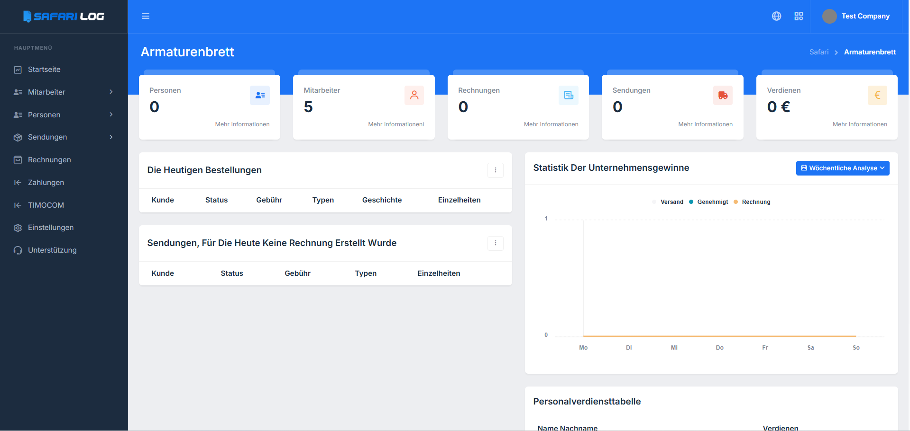
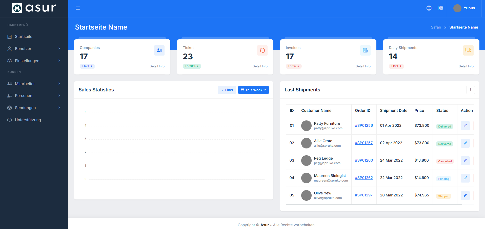

## Company Dashboard

From this panel, you can manage your logistics company by using the personnel working in your company, the shipments created by these personnel, and many modules used in the logistics field.

  

## Super Admin Dashboard

super admin control panel: from this panel you can manage multi-language management, multi-company management, multi-user management, multi-role and permission management and software settings.

  

## Modules

- Multi Company Module.
- Multi User Module.
- Multi Roles and Permissions Module.
- Multi Language Module.
- Bulk Emailler Module.
- Reservation Module
- Customer Management Module
- Invoices Module

## Requirements

- PHP 8.0 or above
- Composer

## Contribute

1. Fork this project.
2. Create a new feature branch (`feature/feature-adi`).
3. Commit your changes (`git commit -m 'New feature added'`).
4. Push the branch to master (`git push origin feature/feature-adi`).
5. Open a Pull Request.

## Licence
This project is licensed under the [MIT License](LICENSE).
